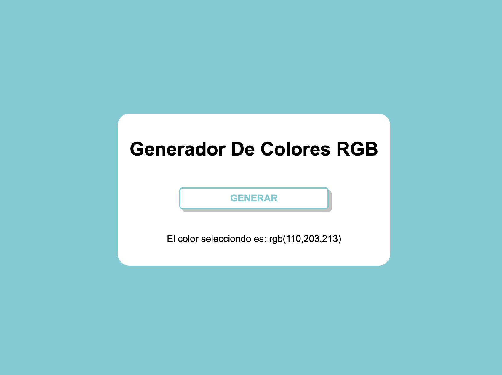

# Generador de colores RGB

## 🚀 Introducción y 📝 requerimientos

En este repositorio puedes encontrar un proyecto generado en **[Piscine Discovery Women's Edition](https://www.fundaciontelefonica.com/noticias/piscine-discovery-womens-edition-formacion-campus-42-talento-digital-femenino/) en 42 Madrid**. 

El objetivo principal ha sido crear un **botón simple cuya función sea cambiar el color del fondo de la página de una forma aleatoria.** Cuando el usuario pulse el botón de la web, se cambiará de forma aleatoria el color del fondo de la web y aparecerá un texto que explicará qué color ha sido el seleccionado dentro de la paleta RGB. 

> **NOTE:** El link directo a este proyecto es  **[link](https://nayraromero.github.io/RGB-color-generator/)**.

## 🛠️ Herramientas

Las tecnologías utilizadas durante este proyecto han sido: 

- **HTML** 
- **CSS Flexbox**
- **GIT version control**
- **JS**

## 💾 Pasos para utilizar este proyecto en vuestro ordenador: 

1. Haz click en la esquina superior derecha del repositorio en el botón **Fork**.
2. Elige el usuario donde quieres ver el proyecto. **Choose your user**.
3. **Ve a github.com/usuario/nombre-del-proyecto**, **clónalo** y ya podrás visualizarlo.

## ✅ Resultado Final 

Muchas gracias 🤗